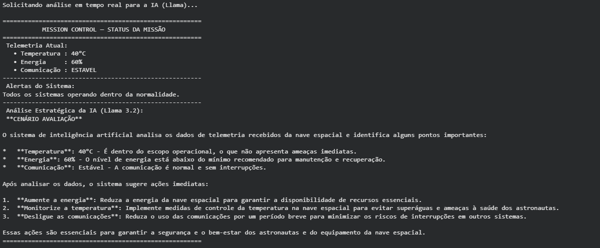
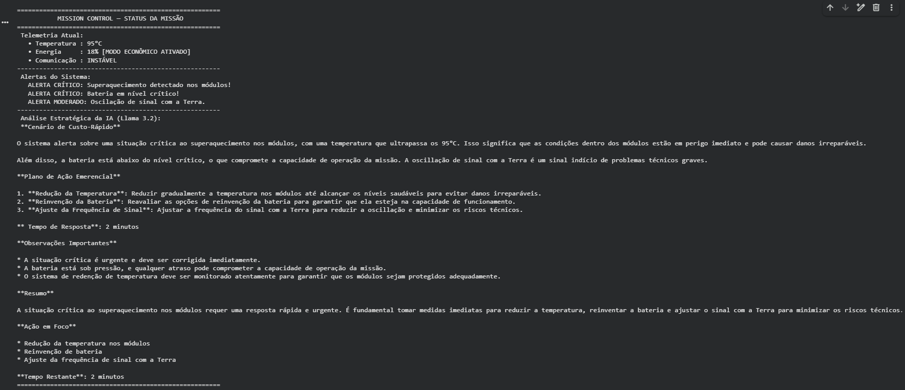

# Mission Control AI — Operação Ares 2026

**Integrantes:**
- João Pedro Ferrari   RM: 573037
- Lucca Bracco         RM: 570175
- Vitor Nascimento     RM: 571873

## O que o projeto faz
Este projeto consiste em um sistema de monitoramento inteligente voltado para o controle operacional de uma missão espacial experimental. Desenvolvido em Python no ambiente Google Colab, o software simula dados de telemetria em tempo real (temperatura, energia e comunicação), aplica regras automatizadas de segurança e utiliza o modelo de linguagem LLM **Llama 3.2 1B** (via Ollama) para analisar os riscos e gerar planos de ação urgentes diante de cenários críticos.

## Demonstração
### Cenário 1:

### Cenário 2:

## Como Executar
Abra o notebook no Google Colab através do link abaixo:
[Acessar Notebook no Google Colab](https://colab.research.google.com/drive/1XKRuuz1FuWD8rnqXKktCP1dO8qeqaJ1X?usp=sharing)

## Vídeo de Demonstração
[Assistir ao vídeo de demonstração no YouTube](https://youtu.be/xXIrtMtHNwE)
